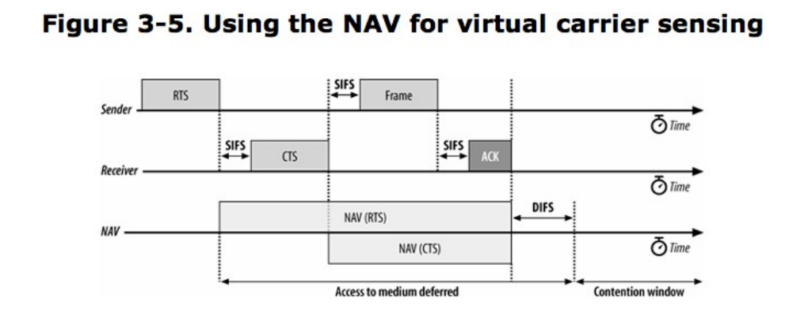
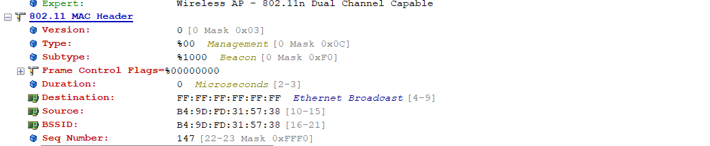

[TOC]

## MAC所面临的挑战

### 射频链路的品质

确实，与Ethernet比较起来，无线链路所面临的最大挑战就是不稳定性。空中的干扰太多，很多因素都能影响到传输。802.11采用肯定确认机制，所有发送出去的帧都必须得到响应。（我有疑问是如果发出去的是广播帧，那么如何得到响应呢？）

### 隐藏节点问题

什么是隐藏节点，比如下图：

节点2可以直接和节点1和节点3通信，但是可能由于距离问题，节点1与节点3不能通信，节点1和节点3对对方来说就是隐藏节点。通常情况下，无线收发器只有半双工的工作模式，无法同时收发数据，当节点1和节点3在同一时间向节点2传输数据时可能造成节点2无从响应任何数据，节点1和节点3也无从得知错误发生，因为只有节点2知道有冲突。

为了防止冲突的发生，802.11允许工作站使用Request to Send（请求模式，简称RTS）及Clear to Send（清除发送，简称CTS）信号来清除传送区域，由于RTS与CTS均会延长交易过程，因此RTS、CTS、数据帧以及最后的响应均被视为相同原子操作的一部分。图3-3 说明了整个过程。

> 如图3-3 所示，节点1有个待传，因此送出一个RTS 以启动整个过程。RTS 本身带有两个目的：预约无线链路的使用权与要求接收到这一的其他工作站保持沉默。一旦收到 RTS 帧，接收端会以CTS 应答。和RTS 一样，CTS 也会令附近的工作站保持沉默。等到RTS/CTS完成交换过程，节点1即可传送之前待传的帧，而无需担心来自其他隐藏节点的干扰。
> 整个RTS/CTS 传输过程会用到好几个，实际开始传送数据之前的退避 (backoff) 也会消耗一定的带宽。因此，它通常只用在高用量的环境下以及传输竞争比较显著的场合。对低用量的环境而言，通常无此必要。
> 随着802.11逐渐成熟，隐藏节点已经不再是问题。在小型、静止的只有几个工作站共享一个接入点的网络里，很少会有同时进行传输的情况，何况还有不少闲置带宽可供重传之用。在比较大型的网络环境里，由于覆盖范围内有相当密集的接入点，工作站很有可能坐落在好几个接入点的共同覆盖范围内。(事实上，有些工作站的传输距离对大多数网络而言可能太远，这一点将留待有关网络规划的章节中再进行探讨。)
> 如果802.11 网卡的驱动程序支持用户可通过调整 RTS 值 (threshold) 来控制 RTS/CTS 交换过程。只要大于此阑值，RTS/CTS 交换过程就会进行，小于此值则会直接传送帧。

### MAC 访问模式与时机

>  无线媒介的访问是由协调功能 (coordination function) 控制。Ethernet 之类的CSMA/CA访问是由分布式协调功能 (distributed coordination function，简称DCF)控制。如果需要用到无竞争服务(contention-free service)，则可通过构建于DCF之上的点协调功能(point coordination function，简称PCF)来控制。在各取所需 (free-for-all)的DCF与精确控制的PCF之间，网络也可以介于两种极端之间采取中庸之道的混合协调功能(hybrid coordination function，简称HCF)。无竞争服务只于基础结构型网络(infrastructure network)中提供，不过只要工作站支持HCF就可以在网络中提供服务质量 (quality of service，简称 QoS)功能。协调功能的细节请见图3-4以及下列说明:
>
> * DCF(分布式协调功能)：
>
>   DCF是标准CSMA/CA 访问机制的基础。和 Ethernet一样，在传送数据之前，它会先检查无线链路是否处于清空状态。为了避免冲突的发生，当某个传送者占据信道时，工作站会随机为每个选定一段退避(backoff)时间。在某些情况之下,DCF可利用 CTS/RTS 清空技术进一步减少发生冲突的可能性。
>
> * PCF(点协调功能)：
>
>   点协调功能提供的是无竞争服务。称为点协调者(point coordinator)的特殊工作站可以确保不必通过竞争即可使用媒介。点协调者位于接入点，因此只有基础结构型网络才会使用PCF。为了赋予比标准竞争式服务还高的优先级，PCF允许工作站经过一段较短的时间间隔后即可传送帧。PCF在实现上并不常见。
>
> * HCF(混合协调功能)：
>
>   有些应用需要比尽力传递 (best-effort delivery)更高一级的服务质量，却又不需要用到PCF 那么严格的时机控制。HCF允许工作站维护多组服务队列，针对需要更高服务质量的应用提供更多的无线媒介访问机会。HCF尚未完全标准化，不过终将成为80211e标准的一部分。

### 载波监听功能与网络分配矢量

>  载波监听 (carrier sensing)主要用来判断媒介是否处于可用状态。802.11具备两种载波监听功能;物理载波监听(physical carrier-sensing)与虚拟载波监听 (virtualcarrier.sensing)。只要其中有一个监听功能显示媒介处于忙碌状态，MAC就会将此状况汇报给较高层的协议。

* 物理载波监听：由物理层所提供，取决于所使用的媒介与调制方式。一般的收发器无法同时进行收与发的动作，此外由于隐藏节点随处可见，物理载波监听并无法提供所有必要的信息。
* 虚拟载波监听：虚拟载波监听由网络分配矢量所提供（NAV）。802.11 的帧通常会包含一个 Duration 字段，用来预订一段媒介使用时间。NAV 本身其实就是一个定时器(timer),用来指定预计要占用媒介多少时间，以微秒(microsecond)为单位。工作站会将NAV 设定为预计使用媒介的时间，这包括完成整个操作必须用到的所有帧。其他工作站会将NAV的值倒数至零。只要 NAV的值不为零，就代表媒介处于忙碌状态，此即虚拟载波监听功能。当 NAV 为零时，虚拟载波监听功能会显示媒介处于闲置状态。

利用NAV可保证工作站的原子操作 (atomic operation) 不被中断。例如，图3-3 所示的 RTS/CTS 过程即属一种基本操作。图 3-5 说明了 NAV 如何保障整个过程不受干扰(这是本书中的图解所使用的标准格式，用以说明多个工作站之间的互动，每个工作站各自有相应的定时器。) 工作站对媒介的访问操作可用加上阴影的条状图 (shaded bar)来表示，每个条状图 (bar) 均会标上类型。没有任何操作之处会标上帧间间隔(interframe spacing)。在此图底部，NAV线 (line)上的条状图代表NAV定时器。NAV是由RTS与CTS帧上的标头来载送的，此处之所以特别画出一条 NAV线，是为了要显示NAV与空中实际传输情况的关系。只要在 NAV线上出现NAV条状图，工作站就必须延迟访问媒介，因为虚拟载波监听机制将会指出媒介正处于忙碌状态。为了确保整个过程不被中断，节点1会在其 RTS 中设定 NAV，以防止传送 RTS 时其他工作站对媒介进行访问。所有收到RTS 的工作站均会延迟访问媒介，直到 NAV 消失。

### 帧间间隔

* 短帧间间隔(Short interframe space，简称SIFS)

​	SIFS 用于高优先级的传输场合，例如 RTS/CTS 以及肯定确认。经过一段 SIFS时间),即可进行高优先级的传输。一旦高优先级传输开	始,媒介即处于忙碌状态因此相较于必须等待较长时间才能传输的帧，SIFS 消失后即可进行传输的的优先级较高。

* PCF帧间间隔(PCFinterframe space，简称PIFS)

​	PIFS主要被 PCF使用在无竞争操作中，有时被误称为优先级间间隔 (priorityinterframe space)。在无竞争时期，有数据待传的工作站	可以等待 PIFS 后再加以传送，其优先级高于任何竞争式传输。

* DCF帧间间隔(DCFinterframe space，简称DIFS)

​	DIFS是竞争式服务中最短的媒介闲置时间。如果媒介闲置时间长于DIFS，则工作站可以立即对媒介进行访问。

* 扩展顺间间隔(Extended interframe space，简称EIFS)

​	图3-6并没有标明EIFS因为 EIFS 并非固定的时间间隔。只有在传输出现错误时才会用到 EIFS。

### 利用DCF进行基于竞争的访问

> 大部分的传输操作均会采用 DCF (分布式协调能)它提供了类似 Ethernet的基于竞争的服务。DCF 允许多个独立的工作站彼此交互，无需通过中心控制节点，因此可以运用于IBSS网络或基础结构型网络。
> 试图传送任何数据之前，工作站必须查看媒介是否处于闲置状态。若它处于忙碌状态工作站必须延迟访问并利用指数退避(exponential backoff) 算法来避免发生冲突。
> 我们可从802.11MAC的规则中归纳出一组经常使用的基本规则，其他额外规则的应用则视情况而定。在所有使用 DCF 的传输中将会运用到两项基本规则:
>
> 1. 如果媒介闲置时间长于DIFS，便可立即进行传输。载波监听同时可以物理与虚拟1(NAV)两种方式进行。
>    a. 如果之前的帧接收无误，则媒介必须至少空出一段 DIFS
>    b. 如果之前的传输出现错误，则媒介必须至少空出一段 EIFS如果媒介处于忙碌状态，则工作站必须等候至信道再度闲置，802.11称之为访问延迟 (access deferral)。一旦访问延迟，工作站会等候媒介闲置一段 DIFS，同时准备指数退避过程 (exponential backoff procedure)。

>  在特定情况下会运用到一些额外的规则。其中有一些规则取决于“线上”(on the wire)的特殊情况且与之前传送的结果有关。
>
> 1. 错误恢复(error recovery)是发送端的责任。发送端预期每个帧均应收到确认，如果没有收到确认则必须负责发送帧，直到成功为止。
>      a. 唯有收到肯定确认 (positive acknowledgment)才表示发送成功。原子交换操作必须全部完成才算成功。如果某个预期的确认迟迟未到，发送端即会认定其已丢失，必须重新发送。
>      b. 所有单播 (unicast) 数据必须被确认，广播数据则不予确认。(因此，即使无线链路本质上属于广播媒介，相较于广播数据，单播数据基本上还是具备较高的服务质量。)
>      c. 只要发送失败，重试计数器 (retry counter)就会累加，然后重新发送。发送失败有可能是因为访问媒介失败，也可能是因为得不到确认。不论如何，重传时会等待一段较长时间 
> 2. 多序列可以在传送过程的每个步骤中更新NAV。当所收到的媒介预订时间比当前的NAV还长时，工作站即会更新NAV。
> 3. 以下的帧类型可在SIFS之后传输，因此优先级较高:确认(acknowledgment)，RTS/CTS交换过程中的CTS以及片段序列(fragment sequence)中的片段(fragment)。
>      a. 一旦发送出第一个帧，工作站就会取得信道的控制权。后续帧及其确认均可使用SIFS 进行传送，以锁定信道不被其他工作站占用。
>      b.传送操作中，后续会将 NAV 更新成该媒介预计使用的时间。
> 4. 如果较高层的包 (higher-level packet)的大小超过所设定的阑值 (threshold)，则必须使用扩展帧序列 (extended frame sequence)。
>      a. 包的大小超过 RTS 阔值，必须使用 RTS/CTS 交换过程a.
>      b. 长度超过分段 (fragmentation)值，必须加以分段。

## DCF与错误恢复

错误检测与更正 (error detection and correction)是由开始原子交换过程的工作站来担任。一旦检测到错误，该工作站必须负责重新发送。错误检测必须由发送端负责。有时候，发送端可根据肯定确认来推论帧是否已经丢失。只要帧被重新发送，重试计数器(retry counter)就会累加。

## DCF的退避算法

当帧传送完成且经过一段DIFS，工作站便会试图传送之前拥堵的数据。DIFS之后紧接的一段时间称为竞争窗口(contention window)或退避窗口 (backoff window)。此窗口(window)可进一步分制为时隙(slot)。时隙长度因媒介而异，速度较高的物理层会使用较短的时隙。工作站会随机挑选某个时隙，等候该时隙到来以便访问媒介。所有时隙的选择机会均等。当多个工作站试图同时传送数据时，挑到第一个时隙(即取得最小随机编号)的工作站可以优先传送。

## 帧格式

一般的802.11 MAC帧格式：

### Frame Control字段

所有的帧开头都是长为2字节的`frame control`字段，`frame control`字段包括以下的子字段：

#### Protocal

Protocol (协议版本)字段由两位构成，用以显示该所使用的 MAC版本。目前802.11 MAC 只有一个版本，它的协议编号为0。如果IEEE 将来推出不同于原始规范的 MAC版本，才会出现其他的版本编号。到目前为止，802.11 改版尚不需用到新的协议编号

#### Type与Subtype字段

Type (类型)与Subtype (子类型)字段用来指定使用的类型。为了因应噪声与提升可靠性，802.11 MAC内置了一些管理功能。有些功能之前已经提过，如RTS/CTS操作与确认 (acknowledgment)。表3-1显示了Type 与Subtype字段跟帧类型的对应关系。
如表 3-1 所示，最高有效位会最先出现，恰好与下图相反。因此，Type 子字段是`frame control`字段的第三位之后的第二个位 (b3 b2)，而 Subtype 子字段则是第七位之后的第六、第五以及第四位 (b7 b6 b5 b4)。

​	

表3-1：Type与SubType字段的值与名称

| SubType的值                            | SubType的名称                                   |
| -------------------------------------- | ----------------------------------------------- |
| Management frame（管理帧：Type == 00） |                                                 |
| 0000                                   | Association request (关联请求)                  |
| 0001                                   | Association response (关联响应)                 |
| 0010                                   | Reassociation request (重新关联请求)            |
| 0011                                   | Reassociation response (重新关联响应)           |
| 0100                                   | Probe request(探测请求)                         |
| 0101                                   | Probe response (探测响应)                       |
| 1000                                   | Beacon (信标)                                   |
| 1001                                   | ATIM (通知传输指示消息)                         |
| 1010                                   | Disassociation (取消关联)                       |
| 1011                                   | Authentication (身份验证)                       |
| 1100                                   | Deauthentication (解除身份验证)                 |
| Control frame (控制帧： Type=01)       |                                                 |
| 1010                                   | Power Save (PS)-Poll(省电一轮询)                |
| 1011                                   | RTS (请求发送)                                  |
| 1100                                   | CTS (清除发送)                                  |
| 1101                                   | ACK(确认)                                       |
| 1110                                   | CF-End (无竞争周期结束)                         |
| 1111                                   | CF-End(无竞争周期结束) + CF-ACK(无竞争周期确认) |
| Data frame(数据帧：Type=10)            |                                                 |
| 0000                                   | Data (数据)                                     |
| 0001                                   | Data + CF-ACK                                   |
| 0010                                   | Data + CF-Poll                                  |
| 0011                                   | Data + CF-ACK+CF-Poll                           |
| 0100                                   | Null data (无数据：未传送数据)                  |
| 0101                                   | CF-ACK (未传送数据)                             |
| 0110                                   | CF-Poll (未传送数据)                            |
| 0111                                   | Data + CF-ACK + CF-Poll                         |
| 1000                                   | QoS Data                                        |
| 1001                                   | QoS Data + CF-ACK                               |
| 1010                                   | QoS Data + CF-Poll                              |
| 1011                                   | QoS Data + CF-ACK + CF-Poll                     |
| 1100                                   | QoS Null (未传送数据)                           |
| 1101                                   | QoS CF-ACK (未传送数据)                         |
| 1110                                   | QoS CF-Poll (传送数据)                          |
| 1111                                   | QoS CF-ACK + CF-Poll (未传送数据)               |
| (帧类型 11尚未使用)                    |                                                 |

#### To DS与From DS位

这两个位用来指示帧的目的地是否为分布式系统(distribution system)。在基础结构型网络里，每个帧都会设定其中一个DS 位。你可以根据表3-2来解读这两个位。

表3-2：To DS与From DS位所代表的意义

|           | To DS=0                                              | To DS=1                                |
| --------- | ---------------------------------------------------- | -------------------------------------- |
| From DS=0 | 所有管理与控制帧。IBSS里的数据帧(非基础结构型数据帧) | 基础结构型网络里无线工作站所传送的数据 |
| From DS=1 | 基础结构型网络里无线工作站所收到的数据帧             | 无线桥接器上的数据帧                   |

#### More fragments位

此位的功能类似IP的“more fragments”位。若较上层的封包经过MAC分段处理除了最后一个片段，其他片段均会将此位设定为1。大型的数据帧以及某些管理帧可能需要加以分段，除此之外的其他帧则会将此位设定为0。实际上，大多数数据帧均会以最大的 Ethernet 大小进行传送，不过帧分段并不常用。

#### Retry位

有时候可能需要重传帧。任何重传的帧会将此位设定为1以协助接收端别除重复的帧。

#### Power management 位

802.11 网络适配器通常以 PC Card 的形式出现，主要用于以电池供电的膝上型或手持式计算机。为了延长电池的使用时间，通常可以关闭网络接口以节省电力。此位用来指出发送端在完成当前的原子帧交换之后是否进入省电 (power-save) 模式。1代表工作站即将进入省电模式，而0则代表工作站会一直保持在清醒状态。接入点必须行使一系列重要的管理功能,所以不允许进入省电模式，因此接入点所传送的帧中此位必然为0。

#### More data 位

为了服务处于省电模式中的工作站，接入点会将这些从分布式系统接收来的帧加以缓存。接入点如果设定此位，即代表至少有一个帧待传给休眠中的工作站。

#### Protected Frame 位

相对于固定式网络，无线传送本质上就比较容易被拦截。如果帧受到链路层安全协议的保护，则此位会被设定为1，而且该帧会略有不同。之前，Protected Frame位被称为WEP位。

#### Order位

帧与帧片段可依次传送，不过发送端与接收端的MAC必须付出额外的代价。一旦进行严格依次 (strict ordering) 传送，则此位会被设定为1。

### Duration/ID 字段

Duration/ID字段紧跟在 Frame Control字段之后。此字段有许多功用，有三种可能的形式，如图3-11所示。

#### Duration：设定NAV

当第15个位被设定为0时，Duration/ID字段就会被用来设定NAV。此数值代表当前所进行的传送预计使用媒介多少微秒。工作站必须监视所收到的任何帧头并据此更新NAV。任何超出预计使用媒介时间的数值均会更新 NAV，同时阻止其他工作站访问媒介。

#### 无竞争周期所传送的帧

在无竞争周期 (contention-free period，简称CFP)，第 14 位为0，而第 15 位为1，其他所有位均为0，因此Duration/ID字段的值为32768。这个数值被解读为NAV。它让没有收到 Beacon (信标)的任何工作站都得以公告无竞周期，以便将NAV更新为适当的数值，从而避免干扰到无竞争传送。

#### PS-Poll帧

在PS-Poll(省电一轮询)中，第14位与第15位会被同时设定为1移动式工作站可以关闭天线以达到省电目的。休眠中的工作站必须定期醒来。为确保不遗漏任何帧，从休眠状态醒来的工作站必须送出一个PS-Pol1,以便从接入点取得之前缓存的任何帧此外，苏醒的工作站会在 PS-Pol1中加人关联标识符 (association ID，简称AID)，以显示其所隶属的BSS。AID包含在PS-Poll中，其值介于1 ~ 2007，而介于2008 ~ 16383的值目前并未使用。

### Address 字段

一个802.11帧最多可以包含4个地址 (Address)字段。这些地址字段均经过编号，因为随着帧类型的不同，这些字段的作用也有所差异。基本，Address 1代表接收端Address 2代表发送端、Address 3字段被接收端拿来过滤地址举例而言在基础结构型网络里，第三个地址字段会被接收端用来判断该帧是否属于其所关联的网络。

802.11所使用的寻址模式乃依循其他IEEE 802 网络所使用的格式，包括 Ethernet。地址本身的长度有48位。如果传送给实际媒介的第一个位为0，则该地址代表单一工作站(单播unicast)如果第一位为1,则该地址代表一组实体工作站，称为组播(multicast)地址。如果所有位均为1，该即属广播 (broadcast)，因此会传送给所有连接至无线媒介的工作站。

* 目的地地址

  和Ethernet一样，目的地地址 (destination address)是长为48位的IEEE MAC标识符，代表最后的接收端，即负责将帧交付上层协议处理的工作站。

* 来源地址

  这是长为48位的IEEE MAC标识符，代表传送的来源。每个只能来自单一工作站，因此Individual/Group位必然为0，代表来源地址 (source address)为单一工作站。

* 接收端地址

  这是长为48位的IEEE MAC标识符，代表负责处理该的无线工作站。**如果是无线工作站，接收端地址(receiver address)即为目的地地址(destination address)**如果帧的目的地是与接入点相连的Ethernet 节点，接收端即为接入点的无线接口，而目的地地址可能是接至 Ethernet 的一部路由器。

* 发送端地址

  这是长为48位的IEEE MAC标识符，代表将传送至无线媒介的无线接口。发送端地址(transmitter address)通常只用于无线桥接。

* 基本服务集标识符

  要在同一区域划分不同的无线局域网络，可以为工作站指定所要使用的BSS(基本服务集)。在基础结构型(infrastructure)网络里，BSSID(基本服务集标识符)即是接入点无线接口所使用的MAC 地址。而独立型 (ad hoc) 网络则会产生一个随机的BSSID并将Universal/Local位设定为1，以防止与其他官方指定的MAC地址产生冲突。

要使用多少地址字段取决于帧类型。**大部分的数据帧会用到3个字段:来源、目的地以及BSSID**。数据帧中，地址字段的编号与排列方式取决于帧的传送路径。大部分的传送只会用到3个地址，这解释了为什么在格式中 4个地址字段只有其中3个字段是相邻的。

### Seq Control字段

此字段的长度为16位，用来重组帧片段以及丢弃重复。它是由4位的片段编号(fragment number)字段以及12位的顺序编号 (sequence number)字段组成。

当上层帧交付给 MAC传送时，会被赋予一个顺序编号。此字段的作用相当于已传帧的计数器取4096 的模数 (modulo)。此计数器从0起算，MAC 每处理一个上层封包它就会累加1。如果上层封包被分段处理，则所有顿片段都会具有相同的顺序编号。如果是重传帧，则顺序编号不会有任何改变。

上图是Omnipeek抓取的一个beacon帧的MAC头。

### 帧主体 frame body

帧主体(frame body) 也称为数据字段 (Data field)，负责在工作站之间传递上层有效载荷(payload)。在最初制定的规范中，802.11最多可以传送2304个字节的有效载荷(实现时必须能够容纳更多数据，以便将安全性与QoS 相关标头纳入其中)。802.2 LLC标头具有8个字节，最多可以传送2296个字节的网络协议有效载荷。防止分段必须在协议层加以处理在IP网络中,Path MTU Discovery(路径最大传输单元找寻,RFC 1191)可阻止大于1500个字节的顿的传送。

802.11与其他链路层技术不同之处表现在两个显著的方面。首先，在802.11中并无任何上层协议的标记 (tag)可供区别。上层协议是以额外标头的 type 字段加以标记，同时以之作为802.11有效载荷的开始。其次,802.11通常不会将填补至最小长度。802.11所使用的帧并不大，随着芯片与电子技术的发展，目前已经没有填补的必要。

### 帧校验序列 FCS

CRC循环校验码。

## 基于数据的竞争服务

> 802.11定义了两组截然不同的原子交换过程。其一为 DCF，用于基于竞争的服务(contention-based service)。第二种交换方式为PCF，用于无竞争服务(contention-free service)。无竞争服务所使用的交换方式不仅错综复杂，而且难以理解。鉴于商业化产品很少实现无竞争服务。

### 广播与组播数据或管理帧

广播与组播帧的交换过程最为简单，因为这些帧无需响应。这两种帧也可以视为组帧(group frame),因为其接收对象不限于单一工作站。成帧(framing)与寻址(addressing)在802.11中较为复杂，适用此规则的的类型如下所示：

* 广播数据帧会在Address1字段中填入广播地址
* 组播数据帧会在Address1字段中填入组播地址
* 广播管理帧会在Address1字段中填入广播地址(Beacon，Probe Request以及IBSS ATIM帧 )

**广播帧无需响应，之前有遇到过一个AP广播Deauth帧，由于广播帧无需响应，所以没法确保其它STA能接收到这个Deauth。**

> 组播帧无法分段，也无需得到确认。整个原子交换过程只牵涉到一个帧，根据基于竞争的访问控制 (contention-based access control) 规则加以传送。传送结束后，所有工作站必须等待一段DIFS，然后在竞争窗口 (contention window)倒数随机产生的延迟时间。
>
> 因为帧的交换过程只牵涉到一个，所以将NAV (网络分配矢量)设定为0。既然此后已无其他帧，也就不必使用虚拟载波监听来锁定媒介以防止其他工作站的访问。传送该帧之后，所有工作站均会等候一段DIFS，然后通过竞争窗口 (contention window)开始为任何被延迟的帧进行倒数。

### 单播帧

在 802.11标准中，针对个别工作站所传送的称为直接数据 (direct data)。称之为单播 (unicast)。单播必须得到确认以确保可靠性，也意味着可借助各种机制来改善传送效率。本节所描述的交换过程适用于任何单播帧，因此也适用于管理帧与数据帧。实际上，这些操作通常只用于数据帧。

#### 帧分段

帧分段是由MAC的分段阈值 (fragmentation threshold) 参数控制。大部分的网卡驱动程序都允许用户设定此参数。任何超过分段阈值的帧都会被分段，分段方式因具体实现而异。调高分段阈值意味着帧的传送负担较小，不过帧遗失与损坏的成本较高，因为将会有较多的数据必须丢弃与重传。调低分段阈值意味着传送负担较重，不过在面临较恶劣的环境时，这种做法可以提供较好的稳定性。

- [ ] 实践：Broadcom的网卡驱动怎么设定MAC的分段阈值？

...

## 多种速率支持

> 能够以不同速度操作的网络技术必须具备一种机制，可以协商出一种收发端彼此均可接受的数据传送速率。速度协商对工作站而言尤其方便。工作站可以经常变换速度，以适应无线电波环境的快速变动。当工作站间的距离改变时，速度也会随之变动。工作站必须能够适应随时变动的环境，必要时更改传送速率。和一些其他协议功能一样，802.11标准并未规范该如何选择传送速率。标准只是提出一般原则，在实现上厂商中享有相当大的自由。其中，有些通则适用于所有工作站:
>
> 每个工作站均持有一份操作速率(operational rate)列表，其中记录工作站与所连接BSS 均支持的所有速率。(所谓BSS，通常相当于一个接入点，不过较新的产品可以让用户根据虚拟接入点自定义操作速率。)高于操作速率集的传送速率是不允许用来传送帧的。

原来支持多种速率的原因是这个。^-^

## 帧的处理与桥接

帧从无线到有线或从有线到无线需要经过一系列的处理。

### 无线至有线

1. 当接入点接收到一个帧时，首先会检测该帧基本的完整性。接下来，接入点会针对所使用的物理层，查看本章之前讨论过的物理层标头，然后验证 802.11 上的校验码(FCS)。
2. 验证帧接收无误后，接入点就会继续查看是否应该进一步处理该帧
   1. 传送至接入点的帧会将接入点的MAC 地址 (即BSSID)作为802.11 MAC标头的Address 1字段。不匹配该接入点的 BSSID的应予以丢弃(有些产品并未实现此步骤)。
   2. 802.11 MAC接着检测且移除重复的帧。产生重复的原因很多，**不过最常见的情况是802.11确认在传送过程中遗失或损坏**。为了简化上层协议的操作，因此由 802.11 MAC负责别除重复的顿。
3. 一旦接入点判断出需要进一步处理该帧，就必须予以解密，因为该帧受到链路层安全算法的保护。
4. 成功解密之后，接入点即查看该帧是否为帧片段，是否需要进一步重组。完整性保护 (integrity protection)针对的是重组后的完整帧，而不是个别的帧片段。
5. 如果经过步骤2.1的BSSID校验，判断接入点必须桥接该帧，较复杂的802.11 MAC标头就会被转换为较简单的 Ethernet MAC标头。
   1. 记录在80211MAC标头的Address 3字段里的目的地地址会被复制到Ethernet的目的地地址。
   2. 记录在802.11MAC标头的 Address 2字段里的来源地址会被复制到 Ethernet的来源地址。
   3. 在802.11 Data 字段里的 SNAP标头将 (Type 字段里的)类型代码复制到Ethernet 帧里的 Type 字段中。如果该 Ethernet 也使用SNAP，就复制整个SNAP标头。
   4. 顺序信息主要供帧片段重组之用，不过当帧被桥接之后即予以丢弃。
   5. 如果有标准的服务质量 (quality of service)处理过程，即在此进行无线接口与有线接口的QoS映射。不过到目前为止，用来表示服务质量的形式，通常就是在有线帧中使用802.1p 优先级位或者其他的控制形式。
6. 重新计算 FCS (顿校验码)。Ethernet 与 802.11使用相同的算法来计算 FCS，不过802.11 帧多出一些字段，同时受FCS 保护。
7. 将产生的新帧交付给 Ethernet 接口传送。

### 有线至无线

将帧从接入点有线端桥接至无线媒介的过程刚好相反:

1. 验证 Ethernet FCS 后，接入点首先会查看是否需要进一步处理所接收到的帧，即查看该帧的目的地址是否属于当前与接入点关联的工作站。
2. 将SNAP标头附加于Ethernet 帧的数据之前。上层封包以SNAP标头进行封装而其Type字段从Ethernet里的类型代码复制而来。如果该Ethernet帧也使用SNAP则复制整个 SNAP标头。
3. 对帧的传送进行调度。802.11包含复杂的省电操作，将置于传送队列 (transmitqueue)之前，接入点可能会将缓存于缓冲区。
4. 一旦帧被置于队列待传，就会被赋予一个顺序编号。如有必要，所产生的数据可以用完整性校验值加以保护。如果帧需要分段，则会根据事先设定好的分段阈值进行分段。分段帧时，Sequence Control 字段中的片段编号也会被赋值。
5. 如果帧需要保护，则对帧(或每个帧片段)的主体加密。
6. 802.11 MAC标头根据 Ethernet MAC标头产生。
   1. 将 Ethernet 的目的地地址复制到 802.11 MAC标头的Address I 字段。
   2. 将 BSSID 置于 Address 2 字段以作为无线媒介上的发送者
   3. 将帧的来源地址复制到 MAC 标头的 Address 3 字段中。
   4. 将其他字段填入 802.11 MAC 标头。也就是把预计传送时间填入 Duration 字段并把适当的标记填入 Frame Control 字段。
7. 重新计算 FCS(帧校验码)。Ethernet 与802.11使用相同的算法来计算 FCS，不过802.11帧多出一些字段，同时受FCS 保护。
8. 将产生的新帧交付给 802.11 接口传送。

### 服务质量扩展

服务质量扩展功能 (quality of service extension)会影响的传送顺序，但并不会改变通过802.11 MAC的基本路径。802.11e服务质量扩展功能并非只用单一传送队列，而是在上述有线至无线桥接过程中的第 4、5、7步中采用多组传送队列。这些步骤会根据优先次序 (priority order) 进行处理，而优先次序取决于的内容以及配置设定中预先指定的优先级分级规则。
