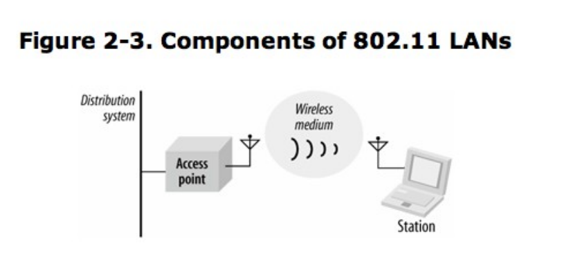

## IEEE802 网络技术族谱

> 说穿了，802.11 只不过是另一种可以利用 802.2/LLC 封装 (encapsulation) 的链路层。802.11基本规范涌盖了802.11MAC以及两种物理层(physical layer):一种是跳频扩频(frequency-hopping spread-spectrum，简称 FHSS)物理层，另一种是直接序列扩频(direct-sequence spread-spectrum，简称DSSS)物理层。后来改版时，802.11陆续加入了其他不同的物理层。802.11 规范了高速直接序列扩频 (HR/DSSS)物理层。基于802.11b 的产品在1999 年问世，是第一款于大众市场销售的物理层。802.11a 所规范的物理层主要是以正交频分复用 (orthogonal frequency division multiplexing，简称OFDM)技术为基础。基于802.1la的产品在本书第一版完成之际已经开始发布。802.11g是目前最新开发的物理层，它采用OFDM以便提升连接速度，但同时也能够向下兼容于802.11b。不过，向下兼容是需要付出代价的。如果 802.11b 与802.11g 的用户同时访问同一个接入点，将需要用到额外的协议，因此会拖累802.11g 用户的连接速度。

802网络家族还是比较庞大的，802.11和802.3都利用802.2封装。

> 以无线电波 (radio wave)为物理层还需要比较复杂的 PHY。802.11将 PHY进一步划分为两个一般组件:一个是物理层会聚过程 (Physical Layer Convergence Procedure,简称PLCP),负责将MAC映射到传输媒介，另一个是物理媒体相关(Physical MediumDependent，简称PMD)，负责传送这些帧。

## 802.11相关术语及设计

这个图是802.11 LAN组件，这些组件包括有：

* 工作站(Station)
  **构建网络的目的是为了在工作站间传送数据。所谓的工作站 (station)，是指配备无线网络接口的计算设备。**通常，工作站是以电池供电的膝上型 (laptop) 或手持式(handheld)计算机。然而，工作站不见得就是便携式 (portable) 计算设备。有时候，使用无线网络的目的是为了省去拉线的麻烦，桌上型 (desktop) 计算机一样可以使用无线局域网。较宽广的开放空间也可以受惠于无线网络，例如生产线可以使用无线局域网来相互连接。在消费性电子产品方面,802.11也快速成为一种连接标准。Apple的AirPort Express 可以让计算机通过802.11与音响连接。TiVo数字录像机也可以连接到无线网络。有些消费性电子产品厂商已经加人802.11工作组，显然是为了借助802.11 的高速传输能力来传送多媒体数据。

* 接人点(Access Point)
  **802.11网络所使用的必须经过转换，方能被传递至其他不同类型的网络。具备无线至有线(wireless-to-wired)的桥接功能的设备称为接入点(access point，简称AP)**，接入点的功能不仅于此，但桥接 (bridging) 最为重要。起初，厂商倾向于将接入点的所有功能置于单一设备中，不过一些较新的产品则是将 802.11 协议分割为两部分:“精简型”接入点 (thin AP)与接入点控制器 (AP controller)。

* 无线媒介(Wireless medium)

  802.11标准以无线媒介(wireless medium)在工作站之间传递。其所定义的物理层不只是一种，这种架构允许多种物理层同时支持 802.11MAC。802.11最初标准化了两种射频 (radio frequency，简称 RF)物理层以及一种红外线(infrared)物理层，然而事后证明RF物理层较受欢迎。此外，一些其他的射频物理层也已经标准化了

* 分布式系统(Distribution system)
  当几个接人点串联以覆盖较大区域时,彼此之间必须相互通信以掌握移动式工作站的行踪。分布式系统 (distribution system)属于 802.11的逻辑组件，负责将(frame) 转送至目的地。802.11并未规范分布式系统的技术细节。大多数商用产品是以桥接引擎(bridging engine)和分布式系统媒介(distribution system medium共同组成分布式系统。分布式系统是接入点间转发赖的骨干网络,因此通常就称为骨干网络(backbone network)。所有在商业上获得成功的产品几乎都是以Ethernet为骨干网络。

## 网络类型

网络类型有两种，如下图：

图左是独立型，图右是基础结构型。从图中就可以看出来，它们的区别就是有没有AP的参与。没有AP参与的是独立型，也称为AD-hoc。有AP参与的是基础结构型，也称为WLAN。

## 802.11网络运作的方式

### 网络服务

802.11提供9种网络服务，3种用来传递数据，6种属于管理操作，目的是让网络能够追踪移动节点及传递帧。

>* 分布式(Distribution)
>
>  只要基础结构型网络里的移动式工作站传送任何数据就会使用这项服务。一旦接入点接收到帧，就会使用分布式服务将送至目的地。任何使用接入点的通信都会通过分布式服务传播，包括关联至同一个接入点的两个移动式工作站的相互通信。
>
>* 整合(Integration)
>
>  整合服务是由分布式系统提供，它让分布式系统得以连接至非EEE 802.11网络整合功能将因所使用的分布式系统而异,因此除了必须提供的服务,802.11并未加以规范。
>
>* 关联(Association )
>  之所以能够将帧传递给移动式工作站,是因为移动式工作站会向接入点登记或与接入点产生关联。产生关联之后，分布式系统即可根据这些登记信息判断哪个移动式工作站该使用哪个接入点。未关联的工作站不算“在网络上”，就像拔掉 Ethernel网线的工作站。802.11 虽规范了使用这些关联数据的分布式系统必须提供哪些功能，但对于如何实现这些功能并未强制规定。如果使用强健安全网络协议 (robustsecurity network protocol)，那么关联之后才能进行身份验证。在身份验证完成之前，接入点会丢弃来自工作站的所有数据。
>
>* 重新关联(Reassociation)
>  当移动式工作站在同一个扩展服务区域里的基本服务区域之间移动时,它必须随时评估信号的强度并在必要时切换所关联的接入点。重新关联是由移动式工作站所开启，当信号强度显示最好切换关联对象时便会如此做。接入点不可能直接开启重新关联服务。(有些AP会刻意将工作站剔除，强迫它们进行重新关联过程。未来，随着更优秀网管标准的发展，重新关联会更密切依赖底层的基础建设。)一旦完成重新关联，分布式系统会更新工作站的位置记录，以反映出可通过哪个接人点连上工作站。和关联服务一样，在强健安全网络中，除非已经成功完成身份验证，否则来自工作站的数据均会被丢弃。
>
>* 取消关联(Disassociation)
>  要结束现有关联，工作站可以利用取消关联服务。当工作站启动取消关联服务时存储于分布式系统的关联数据随即会被移除。一旦取消关联，工作站即不再附接在网络上。在工作站的关机过程中，取消关联是个礼貌性的动作。不过 MAC在设计时已经考虑到工作站未正式取消关联的情况。
>
>* 身份验证 (Authentication)
>  实体安全防护在有线局域网安全解决方案中是不可或缺的一部分。网络和连接点(attachmen point)受到限制，通常只有位于外围访问控制设备 (perimeter accesscontrol device)之后的办公区才能加以访问。网络设备可以通过加锁的配线柜(locked wiring closet) 加以保护，而办公室与隔间的网络插座只在必要时才连接至网络。无线网络无法提供相同层次的实体保护,因此必须依赖额外的身份验证例程，以保证访问网络的用户已获得授权。身份验证是关联的必要前提，唯有经过身份验证的用户才允许使用网络。工作站与无线网络连接的过程中可能经过多次身份验证。关联之前，工作站会先以本身的 MAC 地址来跟接入点进行基本的身份验证。此时的身份验证通常称为802.11 身份验证，有别于后续所进行的牢靠而经过加密的用户身份验证。
>
>* 解除身份验证(Deauthentication)
>
>  解除认证用来终结一段身份验证关系。因为获准使用网络之前必须经过身份验证解除身份验证的副作用就是终止当前的关联。在强健安全网络中，解除身份验证也会清除密钥信息。
>
>* 机密性(Confidentiality)
>  在有线局域网中，坚固的实体控制可以防止对于数据的绝大部分攻击。攻击者必须能够实际访问网络媒介，才有可能窥视往来的内容。在有线网络中，网线与其他计算资源一样也要受到实体保护。在设计上，实际访问无线网络相对而言较为容易，只要使用正确的天线与调制方式就能办到。
>   802.11初次改版时，机密性 (onfidentiality) 服务原本称为私密性 (privacy)服务，而且是由目前已经毫无可信度的有线等效加密(Wired Equivalent Privacy，简称WEP)协议所提供的。除了新的加密机制，802.1li 另外提供了两种 WEP 无法解决的关键服务来加强机密性服务，即基于用户的身份验证 (user-basedauthentication)以及密钥管理服务。
>
>* MSDU传递
>  一个网络如果无法传递数据给接收端,大概也没有什么用。工作站所提供的MSDU(MAC Service Data Unit)传递服务负责将数据传送给实际的接收端。
>
>* 传输功率控制(Transmit Power Control)
>
>  简称TPC，TPC是在 802.11h 中定义的新服务。欧洲标准要求操作于5 GHZ 频带的工作站必须能够控制电波的传输功率，避免干扰其他同样使用5 GHZ 频带的用户传输功率控制也有助于避免干扰其他无线局域网。传输距离是传输功率的函数:工作站的传输功率越高，传输距离就越远，也就越容易干扰邻近的网络。如果可以将传输功率调到“刚刚好”(just right)，就可以避免于扰到邻近的工作站。
>
>* 动态频率选择(Dynamic Frequency Selection)
>
>  简称DFS，某些雷达系统的操作在 5 GHZ 范围内。因此，有些管理者强制要求无线局域网必须能够检测雷达系统以及选择未被雷达系统所使用的频率。有些管理者甚至要求无线局域网必须能够均衡使用 (uniform use)5 GH频带，因此网络必须具备重映射信道(remap channel)的能力。

## 扩展服务集

ESS(Extended Service Set)，是由多个AP组成的一个扩展服务集。它的特征有：

* Multi-AP使用相同的SSID。
* station之间使用一个单一的二层连接可以互相通信。
* 连接技术使用VLAN或者tunneling

