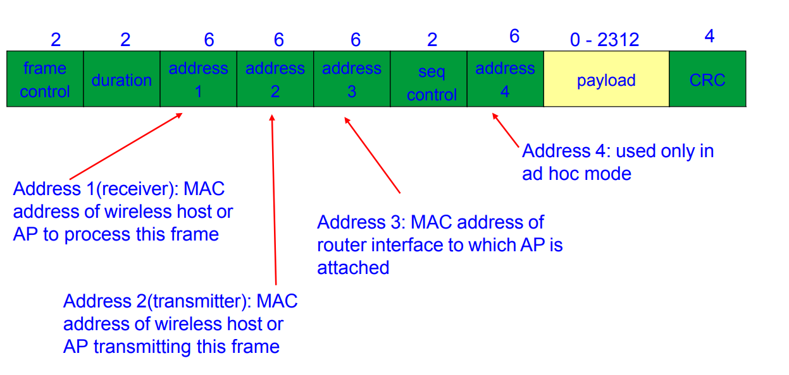

> 802.11帧主要有三种类型。数据帧，管理帧，控制帧。数据帧(data frame)好比802.11中的驮马，负责在工作站之间搬运数据，它可能会因为所处的网络环境不同而有所差异。控制帧(control frame)通常与数据帧搭配使用，负责区域的清空 (area clearing)、信道的取得 (channel acquisition)以及载波监听的维护(carrier-sensing maintenance)，并于收到数据时予以肯定确认 (positive acknowledgment of received data)，借此提高工作站之间数据传送的可靠性。管理帧(management frame)负责监督，要用来加入或退出无线网络以及处理接入点之间关联的转移事宜。

## 数据帧

数据帧 (data frame)会将上层协议的数据置于主体中(frame body)中加以传递。
不同类型的数据帧可根据功能加以分类，其中的一种方式将数据帧分为用于基于竞争的服务的(contention-based service)及用于无竞服务 (contention-free service)的两种数据帧。只能在无竞争周期(contention-free period)出现的就不可能在IBSS(独立基本服务集(复习IBSS：IBSS是由多个无线设备直接通信没有AP的。))中使用。另一种区分方式，则是对携带数据与提供管理功能的帧加以区别。表 4-1显示了数据的分类方式。

| 帧类型              | 基于竞争的服务 | 无竞争服务 | 携带数据 | 未携带数据 |
| ------------------- | -------------- | ---------- | -------- | ---------- |
| Data                | √              |            | √        |            |
| Data+CF-ACK         |                | √          | √        |            |
| Data+CF-Poll        |                | AP only    | √        |            |
| Data+CF-ACK+CF-Poll |                | AP only    | √        |            |
| Null                | √              | √          |          | √          |
| CF-ACK              |                | √          |          | √          |
| CF-Poll             |                | AP only    |          | √          |
| CF-ACK+CF-Poll      |                | AP only    |          | √          |

### Frame Countrol（帧控制）

### Duration （持续时间）

Duration (持续时间)字段用来记载网络分配矢量 (Network Allocation Vector，简称NAV)的值。访问媒介的时间限制由 NAV指定。数据的 Duration 字段的设定必须依循四项规范：

1. 无竞争周期所传递的任何帧必须将Duration字段设定为32768此规范适用于无竞争周期所传递的任何数据帧。
2. 目的地为广播或组播地址的 (Address 1字段设定了组位)的持续时间为0。此类并非原子交换 (atomic exchange) 过程的一部分，接收端也不会加以确认，因此基于竞争的媒介访问可以在广播或组播数据帧结束后立即开始。NAV在交换过程中用来保护对传送媒介的访问。既然广播或组播帧之后不会有来自链路层的确认，因此没有必要为后续帧锁定媒介使用权。
3. 如果 Frame Control字段中的 More Fragments (更多片段)位为0，表示该帧已无其余片段。最后的帧片段只需为本身的确认预订媒介使用权，之后就可以恢复基于竞争的访问了。Duration字段会被设定为传送一个短帧间间隔及片段响应所需要的时间。倒数第二个片段的Duration字段会为最后一个片段锁定媒介使用权。
4. 如果Frame Control字段的More Fragments位被设定为1，则表示其后还有帧片段。因此，Duration字段便会被设定为传送2个确认加上3个短间间隔及下一个帧片段所需要的时间。为非最终片段设定 NAV的方式本质上与RTS 相同，所以也称为虚拟 RTS。

### 寻址与DS位

地址字段的编号与功能取决于设定了哪个DS(分布式系统)位，因此所使用的网络类型会间接影响到地址字段的用法。表 4-2列出了地址字段在数据中的各种用法。只有无线桥接器 (wireless bridge) 才会使用第四个地址字段，因此比较少见。

表4-2：地址字段在数据帧中的用法

| 功能                  | ToDS | FromDS | Address 1（接收端） | Address 2（发送端） | Address 3 | Address 4 |
| --------------------- | ---- | ------ | ------------------- | ------------------- | --------- | --------- |
| IBSS                  | 0    | 0      | DA                  | SA                  | BSSID     | 未使用    |
| To AP（基础结构型）   | 1    | 0      | BSSID               | SA                  | DA        | 未使用    |
| From AP（基础结构型） | 0    | 1      | DA                  | BSSID               | SA        | 未使用    |
| WDS（桥接器）         | 1    | 1      | RA                  | TA                  | DA        | SA        |

Address 1字段代表接收端的地址。在某些情况下，接收端 (receiver) 即为目的地(destination)，但不总是这样。目的地是指负责处理帧中网络层封包的工作站，而接收端则是负责将无线电波解码为802.11的工作站。如果Address 1字段被设为广播或组播地址，则必须同时检查 BSSID(基本服务集标识符)。工作站只会响应来自同一个基本服务集的广播或组播，至于来自其他不同 BSS 的则加以忽略 (注 1)。Address 2字段是发送端的地址，用来发送确认信息。发送端(transmitter)不见得就是来源地(sender)来源地是指产生赖中网络层协议封包的工作站；而发送端则是负责将帧传送至无线链路Address 3 字段则是供接入点与分布式系统过滤之用，不过该字段的用法取决于所使用的网络类型。

### BSSID

每个BSS都会被赋予一个BSSID，它是一个长度为 48位的二进制标识符，用来识别不同的BSS。BSSID 的主要优点是它可作为过滤之用。虽然不同的802.11网络彼此之间可能重叠，但即使如此也不应该让相互重叠的网络收到彼此的链路层广播在infrastructure BSS (基础结构型基本服务集) 中，BSSID就是创建该BSS 的接入点上无线接口的MAC地址。而IBSS(独立基本服务集)则必须创建BSSID，才能产生网络。为了让所创建的地址尽量不重复，BSSID有46位是随机产生的。其所产生的 BSSID会将Universal/Local位设定为 1，代表这是一个本地地址，至于Individual/Group位则会设定为0。两个不同的IBSS如果要产生相同的BSSID，那么它们所产生的 46位随机数必须完全相同。

有一个BSSID 会被保留不用，就是所有位均设定为1的BSSID，又称为广播型BSSID。使用广播型 BSSID 的可以不被 MAC中任何的 BSSID filter 所过滤。**BSSID的广播只有在移动式工作站送出 probe request (探查请求) 以试图找出有哪些网络可以加入时才会被用到。probe 要能够探测现有的网络，就不能被BSSID filter过滤掉。probe 是唯一允许使用广播型 BSSID的帧。**

### 数据帧的类型主题

Data (数据)
子类型为 Data 的帧只有在基于竞争的访问周期才会被传送。这类简单的帧只有一个目的，即在工作站间传送帧主体。
Null (空)
Null帧 (注 2) 看起来有点奇怪。它是由 MAC 标头与FCS 标尾所组成。在传统的Ethernet中，Null帧无非就是额外的负担。在802.11网络中，移动式工作站会利用Null帧来通知接人点改变省电状态。当工作站进入休眠状态时，接入点必须开始为之缓存帧。如果该移动式工作站没有数据要经分布式系统传送，也可以使用 Null帧，同时将 Frame Control (控制)字段的 Power Management (电源管理)位设定为1。接入点不可能进入省电模式，因此不会传送 Null。

1. **保持连接**：Null帧可以用来维持无线连接，防止连接超时或断开。当无线设备之间没有数据要传输时，周期性发送Null帧可以告诉接收方设备连接仍然保持。
2. **能耗管理**：Null帧可用于节省能源。在某些情况下，设备可以进入休眠模式，只需定期发送Null帧以保持连接状态，这有助于减少设备的功耗。

### 数据帧的封装

数据帧的形式取决于网络的类型。帧究竟属于何种类型，完全取决于subtype (子类型)字段，而与其他字段是否出现在帧中无关。

#### IBSS

在IBSS 中使用的address 字段有三种。第一个地址代表 receiver (接收端)，同时也是IBSS 网络中的destination (目的地)地址。第二个地址是 source (来源地)地址。在这些地址之后，伴随而来的是 IBSS的 BSSID。当无线 MAC 收到一个帧时，首先会去检查 BSSID，只有 BSSID 与工作站的相同的才会交由上层协议处理。

#### From AP

From AP帧的第一个地址字段代表无线网络中接收该帧的receiver (接收端)，即该的目的地。第二个地址字段存放了transmitter(发送端)的地址。在infrastructure(基础结构型)网络中，transmitter(发送端)地址即为接入点 (AP) 上无线接口的地址，同时也是 BSSID。最后，该帧会记载帧的来源MAC地址。区分source (来源地)与transmitter (发送端)之所以必要是因为802.11 MAC会将确认（也就是ACK）送给的transmitter (即接入点)，而较上层的协议会将回复送给帧的 source(来源地)。

#### To AP

To AP帧的接收端地址 (RA)为BSSID。在基础结构型网络里，BSSID 即为接入点的MAC地址。送至接入点的帧，其来源地/发送端地址(SA/TA) 是无线工作站的网络接口。接入点并未进行地址过滤的动作，而是使用第三个地址(DA) 将数据转送至位于分布式系统的适当位置。
传送至分布式系统(DS)的的 TODS位会被设定为1，而FromDS位会被设定为0。在基础结构型网络中，移动式工作站不能扮演点协调者 (point coordinator)的角色，因此不能传送含有 CF-Pol (无竞争-轮询)功能的帧。

#### WDS 中的帧

当接入点被部署成无线桥接器(或者 WDS)时会用到4个地址字段。和其他数据帧一样，WDS会使用第一个地址 (RA)代表receiver (接收端)第二个地址(TA)代表 transmitter (发送端)。MAC 层会使用这两个地址送出确认并控制流量例如RTS、CTS及ACK 。另外两个地址字段 (SA 与DA)则用来记载帧的source (来源地)以及 destination(目的地)地址，并且将之与无线链路 (wireless link)所使用的地址区分开来。
在无线桥接链路中，通常不会存在移动式工作站，也不会使用无竞争周期。接入点禁止进入省电模式，因此 Power Management (电源管理)位必然被设定为0。

#### 经过加密的帧

受到链路层安全协议保护的并不算新的帧类型。当帧经过加密处理后,Frame Control(帧控制)字段的 Protected Frame位会被设定为1，至于Frame Body (主体)字段则是以第五章或第七章所描述的加密标头开始，这取决于所使用的是何种协议。

### 控制帧

#### 一般的帧控制字段

* Protocol（协议版本）

  协议版本当前是0，未来可能有新的版本。

* Type（类型）

  控制帧的类型标识符为01。定义时，所有控制帧均使用此标识符。

* Subtype（子类型）

  此字段代表传送的控制帧的子类型

* ToDS位和FromDS位

  控制帧负责仲裁无线媒介的访问，因此只能够由无线工作站产生。分布式系统(DS) 并不会收发控制，因此这两个位必然为0。

* More Fragments(更多片段)位

  控制帧不可能被分段，因此这个位必然为0。

* Retry（重试）位
  控制帧不像管理帧或数据帧那样，必须在队列中等候重新发送，因此这个位必然为0。

* Power Management（电源管理）位

  此位用来指示完成当前的帧交换过程后，传送端的电源管理状态。

* More Data（更多数据）位
  此位只用于管理帧及数据中，在控制帧中此位必然为 0。

* Protected Frame（受保护帧）位
  控制帧不会经过加密，因此对控制帧而言，此位必然为 0。

* Order （次序）位
  控制帧是原子帧交换程序 （atomic frame exchange operation）的组成要件，因此必须依序传送，所以这个位必然为0。

#### RTS（请求发送）

RTS 帧可用来取得媒介的控制权，以便传送“大型”帧。至于多大可称为“大型”，则是由网卡驱动程序中的 RTS threshold (值)来定义（Lin:  这个值可以修改吗？通常情况下，RTS阈值是一个固定的值，设置为默认值，以便自动协调Wi-Fi网络的数据传输。这个默认值通常是2347字节。这意味着，当要传输的数据包大于或等于2347字节时，Wi-Fi设备将使用RTS/CTS机制来协调数据传输，以降低碰撞和提高效率。当数据包小于RTS阈值时，不会使用RTS/CTS机制。）。媒介访问权只能保留给单播（unicast）帧使用，而广播 (broadcast) 与组播 (multicast)只是被简单地传送。就和所有控制帧一样，RTS只包含头。帧主体中并未包含任何数据，帧头之后即为 FCS (校验码)。

#### CTS (清除发送)

CTS 有两种目的，起初，CTS 仅用于回复 RTS ，如果之前没有RTS 出现，就不会产生CTS。后来，CTS 被 802.11g保护机制用来避免干扰较旧的工作站。

#### ACK（确认）

ACK帧就是MAC以及任何数据的传送（包括一般传送RTS/CTS 交换之前的帧、帧片段）所需要的肯定确认 （positive acknowledgment）。服务质量扩展功能放宽了对于数据帧的单一确认的要求。

* ACK的Duration字段：

  根据ACK信号在整个帧交换过程中所处的位置，duration（持续时间）的值可以有两种设定方式。在完整的数据帧及一连串帧片段的最后一个片段中，duration会被设定为0。数据发送端会将Frame Control（控制）字段中的More Fragments （更多片段）位设定为0，表示数据传送已经结束。如果 More Fragments 位为0，表示整个传送已经完成，没有必要再延长对无线信道的控制权，因此会将duration设定为0。
  如果 More Fragments 位为 1，表示尚有片段在传送中。此时 Duration 字段的用法和CTS帧中的Duration 字段相同。传送 ACK以及其短间间隔所需要的时间将从最近的帧片段所记载的duration（持续时间）中减去。如果不是最后一个ACK帧，duration的计算方式就类似CTS duration的计算方式。事实上，802.11的规范说明书将 ACK帧中的 duration 设定称为虚拟CTS。

#### PS-POLL 省电-轮询

当一个移动式工作站从省电模式中苏醒后，便会传送一个 PS-Poll 给接入点以取得任何缓存帧。

### 管理帧

#### 管理帧的结构

所有管理的MAC标头都一样，与的子类型无关。管理帧会使用信息元素 （带有数字标签的数据块）来与其他系统交换信息。

#### 地址字段

和其他帧一样，第一个地址字段是给帧的目的地地址使用的。有些管理帧主要用来维护单一BSS的特性。为了限制广播或组播管理帧所造成的副作用，收到管理帧之后，工作站必须加以查验，虽然不是所有实现均会执行这个BSSID过滤流程。只有在广播或组播来自工作站当前所关联的 BSSID 时，它们才会被送至MAC 管理层。唯一的例外是Beacon帧，毕竟它是用来宣布 802.11 网络的存在。

BSSID是以大家熟悉的方式来指定的。接入点会以本身无线网络接口的MAC地址作为BSSID。移动式工作站会采用当前关联的接入点的 BSSID。位于 IBSS 的工作站则会使用 BSS 创建之初随机产生的BSSID。唯一的例外是：寻找特定网络的工作站可以在发出的中指定该特定网络的 BSSID，或者使用 broadcast（广播型）BSSID来搜索所有邻近的网络。

#### 计算持续时间

管理帧使用 Duration （持续时间）字段的方式和其他没有不同：

1. 无竞争周期内所传送的任何帧均会将持续时间设为 32768 <Lin: 为什么是32768>
2. 基于竞争的访问周期内利用 DCF 所传送的帧会通过 Duration 字段防止别人访问媒介，以确保原子帧交换 （atomic frame exchanges）得以完成。
   1. 如果是广播或组播帧（目的地地址为组地址），则持续时间会设定为0。广播与组播帧无需得到确认，因此NAV无需防止别人访问媒介。
   2. 如果不是最终片段，则持续时间会设为3个SIFS加上下一个片段及其确认所需要的微秒数。
   3. 最终片段的持续时间会设定为一个响应加上一个 SIFS 所需要的时间。

#### 帧主体

管理帧十分灵活。帧主体 (frame body)中的大部分数据如果使用长度固定的字段，就称为固定字段 (fixed field)，如果字段长度不定，就称为信息元素 (information element)。所谓信息元素，是指长度不定的数据块 (data blob)。每个数据块均会标注类型编号与大小，各种信息元素的数据字段都有特定的解释方式。新版的802.11规范说明书允许定义新的信息元素，根据旧版规范说明书所实现的产品可忽略这些新元素。实现时，硬件一般采取向下兼容 (backward-compatible) 原则，因此较旧的产品通常无法加入根据新标准所建立的网络。还好，新功能通常可以停用，以便向下兼容。
除了探讨这些作为基本组件的固定字段与信息元素，本节还会说明这些基本组件如何构成管理帧。802.11 强制规定了这些信息元素的排列次序，不过并非所有元素均有必要本书将以特定的顺序说明这些基本组件，谈到各个子类型时，也会特别标明哪些元素比较少见，哪些元素彼此互不兼容。

### 长度固定的管理帧组件

在管理帧中，可能出现的长度固定的字段有 10 种。长度固定的字段一般简称为字段（field），以便与长度不定的信息元素有所区别。字段本身并无标头可与主体的其他部分进行区别。因为长度与次序固定，所以不需要以字段标头来界定。

#### Authentication Algorithm Number字段

Authentication Algorithm Number （身份验证算法编号）字段占用了2个字节，此字段代表关联发生之前，802.11层(802.11-level) 的最初认证过程所使用的认证类型。此字段容许的值范围列于表 4-3中。目前只定义了两种值，其他值保留给未来版本使用。

表4-3

| 值      | 意义                                           |
| ------- | ---------------------------------------------- |
| 0       | 开放系统身份验证（Open system authentication） |
| 1       | 共享密钥身份验证（Shared Key authentication）  |
| 2~65535 | 保留                                           |

#### Authentication Transaction Sequence Number字段

身份验证过程分为好几个步骤，其中包含从接入点所发出的质询 (challenge) 以及试图关联的移动式工作站所做出的响应。Authentication TransactionSequence Number (身份验证处理序列号)字段是由2个字节所构成，用以追踪身份验证的进度。此字段值介于1到65535 之间，其值不可为0。此字段的用法将于第八章讨论。

#### Beacon interval字段

每隔一段时间就会发出的 Beacon (信标)信号用来宣布802.11 网络的存在Beacon 帧中除了包含BSS 参数的信息，也包含接入点缓存的信息，因此移动式工作站必须仔细聆听Beacons信号。Beacon interval (信标间隔)字段的长度为16位，用来设定Beacon信号之间相隔多少时间单位。时间单位通常缩写为TU，代表1024微秒(microsecond)，相当于1毫秒(millisecond)。有些文档中会以千-微秒(kilo-microseconds)来表示时间单位。Beacon interval字段通常会被设定为 100个时间单位，相当于每 100毫秒或0.1秒传送一次 Beacon 信号。

#### Capability Information 字段

长度为16位的Capability nformation (性能信息)字段，传送 Beacon信号的时候，它被用来通告网络具备何种性能。Capability Information字段也可以使用在Probe Request与Probe Response中。在本字段中,每个位各自代表一个标记(flag)，对应到网络所具备的某种特殊功能。工作站会使用这些通告数据来判断自己是否支持该BSS 所有的功能。未实现性能通告中所有功能的工作站就无法加入该 BSS。

##### ESS/IBSS（扩展服务集/）

## 参考资料

CDWN_802.11.pdf page 27